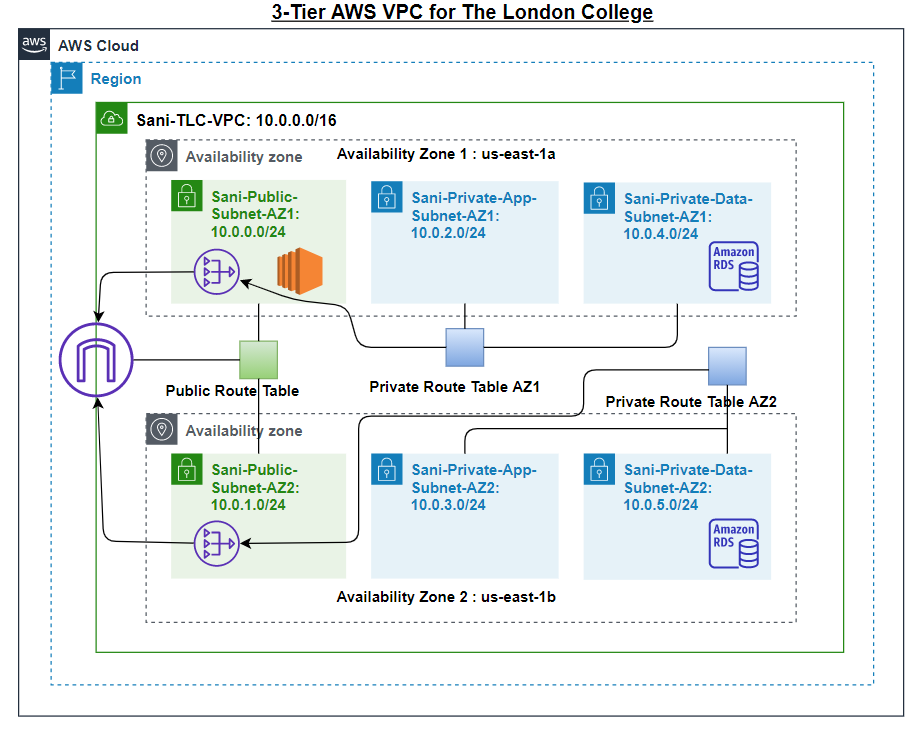
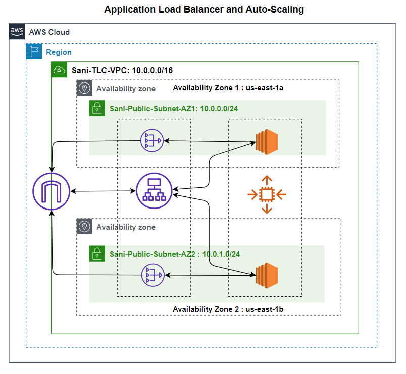

# Cloud Computing Framework

## Overview
This project is part of the **Cloud Computing** course offered by the International School of Management and Technology in partnership with the University of Sunderland. The goal is to design, implement, and document a cloud computing framework for migrating London College's on-premises services to AWS Cloud.

## Tasks Undertaken

### Scenario Analysis
- Evaluated the evolution and fundamental concepts of cloud computing.
- Discussed the benefits of migrating to a cloud computing solution.
- Justified the tools chosen for implementing the cloud computing framework.

### Architectural Framework Design
- Designed a three-tier AWS VPC (Virtual Private Cloud) architecture.
   - 
   - 
- Defined components and services required for the framework:
  - VPCs, subnets, route tables, and gateways.
  - EC2 instances, security groups, and NAT gateways.
- Created a scalable and secure architecture for London College's IT infrastructure.

### AWS Cloud Configuration
- Configured key AWS services:
  - **Networking**: Created VPCs, subnets, route tables, and gateways.
  - **Compute**: Launched EC2 instances with appropriate security group rules.
  - **Scalability**: Configured auto-scaling groups with load balancers for traffic distribution.
- Implemented NAT gateways for private subnet internet access.

### Auto-Scaling and Load Balancing
- Configured an application load balancer to distribute traffic across EC2 instances.
- Implemented auto-scaling groups to dynamically adjust instance count based on demand.

### Testing and Troubleshooting
- Tested the auto-scaling group to ensure seamless scaling during demand spikes.
- Documented troubleshooting methods for common issues encountered during configuration.

## Files and Documentation
- **Scenario Document**: Requirements and initial design considerations.
- **Configuration Files**: Scripts and screenshots for all AWS configurations.
- **Testing Results**: Detailed testing procedures and outcomes for each feature.
- **Troubleshooting Guide**: Steps to identify and resolve issues during cloud setup.

## Author
This project was completed as part of the Cloud Computing course. For inquiries, contact sanisa00@outlook.com.
